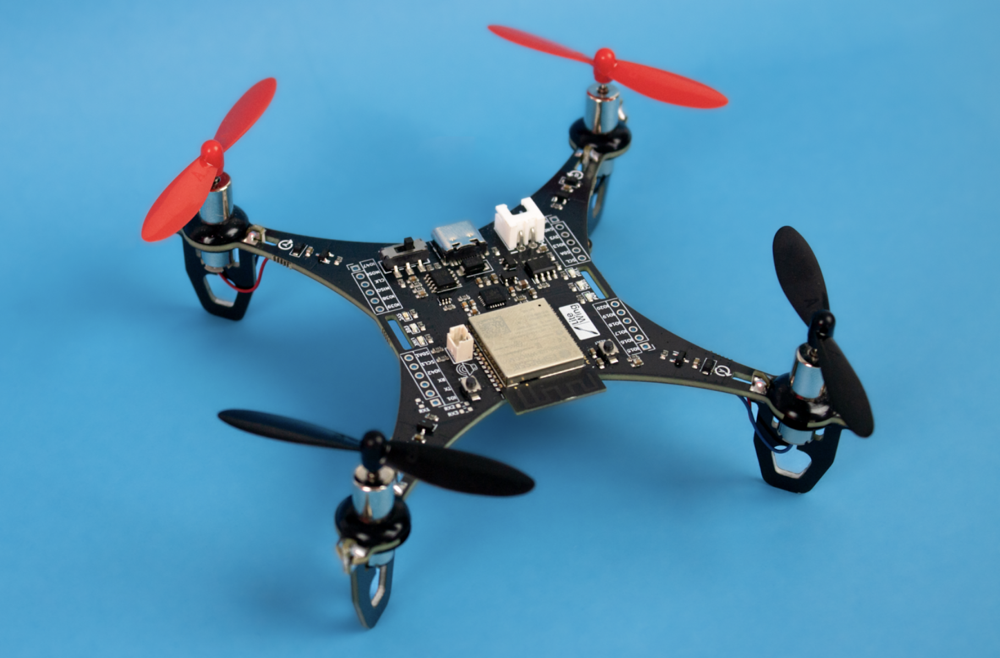

# lrrk-air-mini / LiteWing

Open source hardware and software for the LiteWing compact Wi-Fi drone, with a
host-side control and AI-assistance layer under active development.



LiteWing is an ESP32-S3-based quadcopter platform. The board combines the
flight controller, brushed-motor drivers, battery charging, USB serial, and
Wi-Fi control on one small PCB. The firmware in this repository is the
ESP-Drone/Crazyflie-compatible flight stack supplied by the upstream LiteWing
project; the host tools use its CRTP-over-UDP interface.

## Repository status

This repository is the maintained `lrrk-air-mini` source tree. The original
LiteWing repository is retained as the `upstream` Git remote for provenance and
source comparison. AI assistance is being added as a host-side, advisory layer:
it may inspect telemetry and propose bounded actions, but it cannot directly
write motor outputs and flight actions require an explicit human approval gate.

The port boundary and dependency inventory are documented in
[`docs/PORT_AND_DEPENDENCIES.md`](docs/PORT_AND_DEPENDENCIES.md). Hardware and
firmware changes remain unflashed until the board revision, battery state, and
bench safety checks are verified.

## Firmware build

The firmware is an ESP-IDF project. Install a compatible ESP-IDF toolchain,
select the ESP32-S3 target, then build from the repository root:

```sh
idf.py set-target esp32s3
idf.py build
```

Do not run `idf.py flash` while a battery is connected or propellers are
installed. The default LiteWing firmware exposes a Wi-Fi network and accepts
CRTP/UDP control from a host on the same network.

## Host tools

The existing examples are under [`Python-Scripts/`](Python-Scripts/). The
maintained AI-assistance host service will live separately from the flight
controller and will default to dry-run/advisory mode.

## Upstream

The original LiteWing source and hardware are from
[`jobitjoseph/LiteWing`](https://github.com/jobitjoseph/LiteWing). Changes in
this repository should retain upstream attribution and keep hardware revisions
traceable to the KiCad files and production BOMs.
